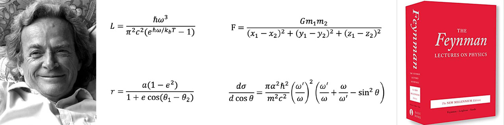

AI Feynman
==========

Quickstart
----------------
.. code-block:: shell-session

  $ pip install aifeynman

  $ python
  >>> import aifeynman
  >>> aifeynman.getdemos('example_data') # download examples from server
  >>> aifeynman.launch("../example_data/", "example1.txt", 30,
                  "14ops.txt", polyfit_deg=3, NN_epochs=500)

This example will get solved in about 10-30 minutes depending on what computer you have and whether you have a GPU.

Here 'example.txt' contains the data table to perform symbolic regression on, with columns separated by spaces, commas or tabs. The other parameters control the search: here the brute-force modules tries combinations of the 14 basic operations in '14ops.txt' for up to 30 seconds, polynomial fits are tried up to degree 3, and the interpolating neural network is trained for up to 500 epochs.

Note that for now, AI Feynman is supported only for Linux and Mac environments.

More examples
---------------------
::

  python examples/example.py

ai_feynman_example.py contains an example of running the code on some examples, found in the example_data directory, corresponding to equations I.8.14, I.10.7 and I.50.26 in Table 4 of this paper. More data files on which the code can be tested on can be found in the Feynman symbolic regression dataset.

You can also find more details on how to get our code running in `this Medium article <https://towardsdatascience.com/ai-feynman-2-0-learning-regression-equations-from-data-3232151bd929>`_.

.. toctree::
   :hidden:
   :maxdepth: 1

   installation
   usage
   inputformat
   outputformat
   faq

